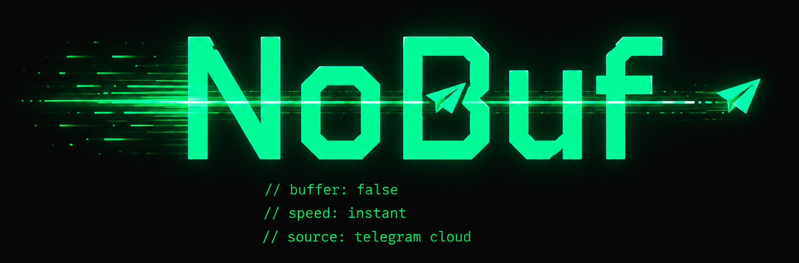
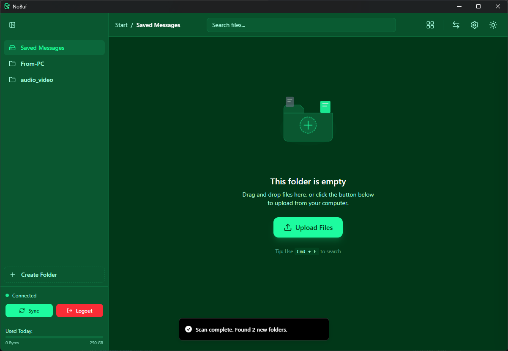
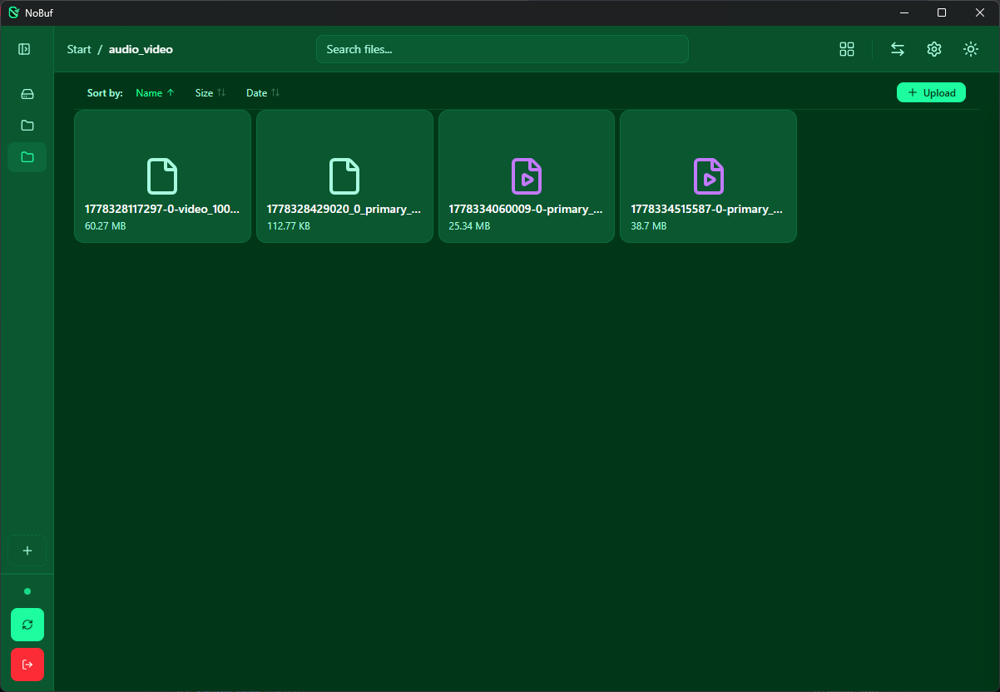
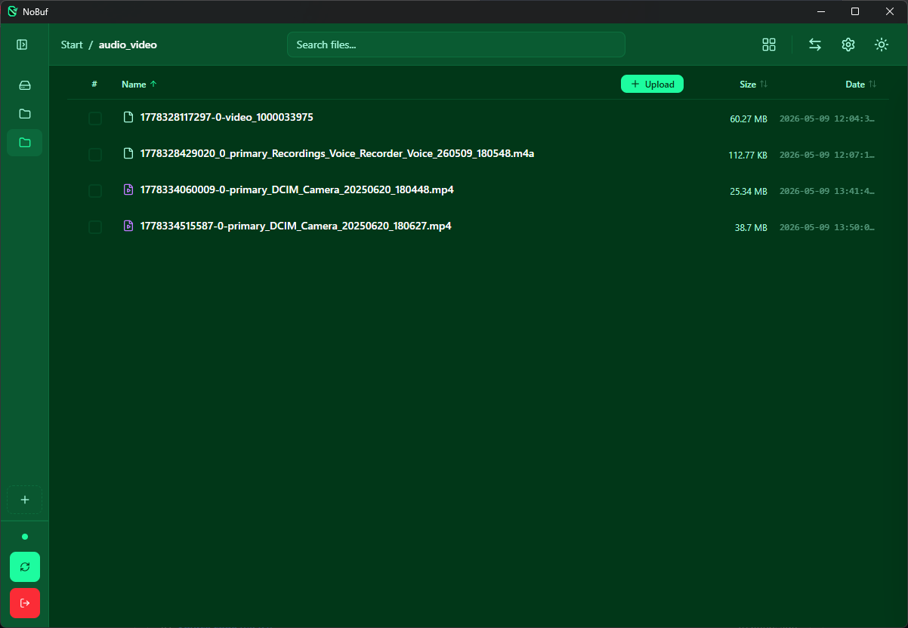
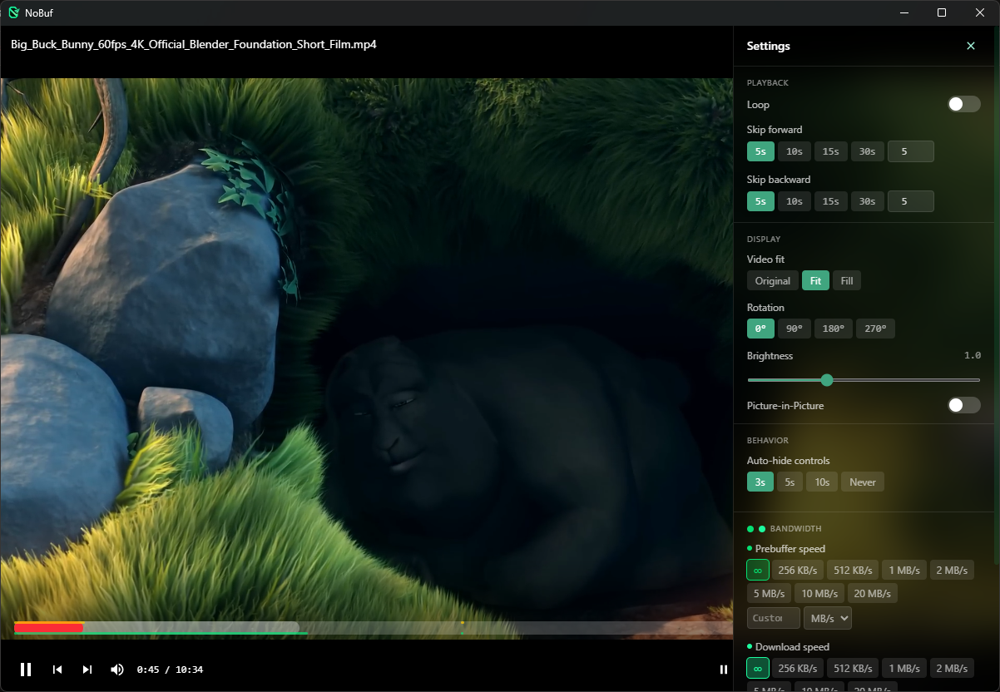
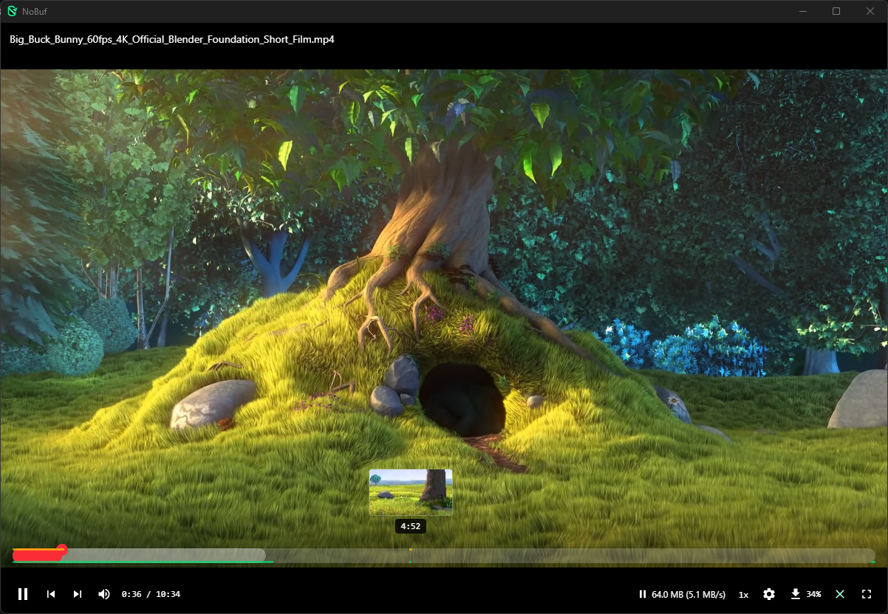
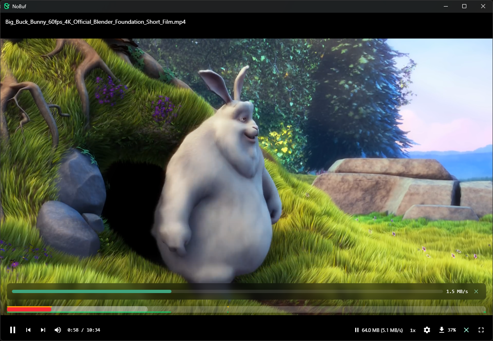
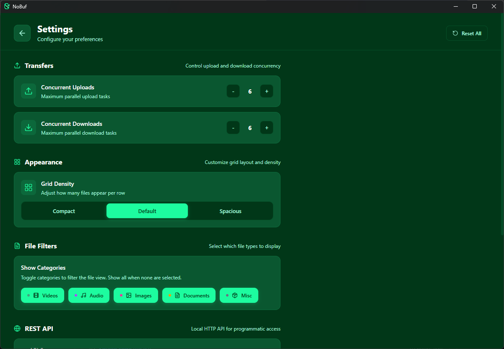
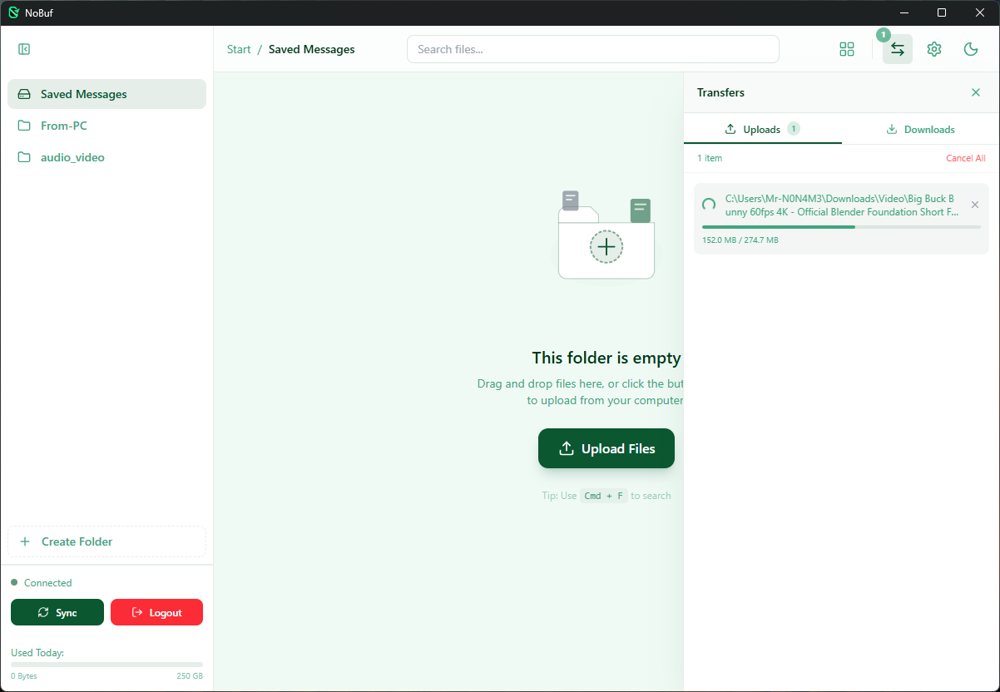

<p align="center">
  
</p>

<h1 align="center">NoBuf</h1>

<h3 align="center">Your Telegram channels, as a video library that plays instantly.</h3>

<p align="center">
  A free desktop app that streams video straight out of Telegram — no downloading first,
  no waiting, no spinner. Press play and it plays.
</p>

<p align="center">
  <a href="https://github.com/Istiaq-Edu/NoBuf/releases"></a>
  <a href="LICENSE"></a>
  
  
  
</p>

---

> ## 🎁 [Get $200 Free API Credit →](https://agentrouter.org/register?aff=rBMj)
>
> Free credit for **Opus 4.8 · Opus 5 · GPT 5.6-sol · Kimi K-3 · GLM 5.3 · DeepSeek v4**
>
> **[Claim it here](https://agentrouter.org/register?aff=rBMj)** → click **Login** (leave
> the fields blank) → **Continue with GitHub**
>
> Use an **old GitHub account** for the $100 bonus, and sign up **through that link** for
> the other $100. Any other route and you get less.

---

## Contents

- [What NoBuf does](#what-nobuf-does)
- [Already have a Telegram channel?](#already-have-a-telegram-channel)
- [Install](#install)
- [First run](#first-run)
- [Screenshots](#screenshots)
- [Features](#features)
  - [Video playback](#-video-playback)
  - [Subtitles](#-subtitles)
  - [Audio tracks](#-audio-tracks)
  - [Privacy](#-privacy)
  - [Files and folders](#-files-and-folders)
  - [Public channels](#-public-channels)
  - [Viewers and previews](#-viewers-and-previews)
  - [Settings](#-settings)
- [What plays, and how](#what-plays-and-how)
- [Keyboard shortcuts](#keyboard-shortcuts)
- [Good to know](#good-to-know)
- [Local API for automation](#local-api-for-automation)
- [Build from source](#build-from-source)
- [Under the hood](#under-the-hood)
- [Credits](#credits)
- [License](#license)

---

## What NoBuf does

Telegram gives you unlimited cloud storage. NoBuf turns it into a media library you can
actually *watch* — a proper file manager with folders, drag-and-drop, and a video player
that starts playing in a moment instead of making you download a 4 GB file first.

The trick is that NoBuf never waits for the whole file *before* playing. It grabs a small
piece, starts playing, and from then on downloads the entire video in the background —
always keeping the part just ahead of you topped up first. Seek somewhere new and it's
usually already on disk. Close the player and it carries on until the file is complete, so
next time it plays with no network at all.

**Everything stays on your machine** — no accounts with us, no telemetry, no third-party
servers.

---

## Already have a Telegram channel?

> [!TIP]
> **Just rename it.** Add **`[NB]`** to the channel name and NoBuf picks it up
> automatically as a folder — no re-uploading, no migration.
>
> *Example:* `My Media` → rename to `My Media [NB]` → it appears in NoBuf right away.

---

## Install

Grab the installer for your system from the [**Releases page**](https://github.com/Istiaq-Edu/NoBuf/releases/latest) — no build tools needed.

| System | Download |
|---|---|
| **Windows** | `NoBuf_x64-setup.exe` (installer) or `NoBuf_x64_en-US.msi` |
| **macOS — Apple Silicon** | `NoBuf_aarch64.app.tar.gz` |
| **macOS — Intel** | `NoBuf_x64.app.tar.gz` |
| **Linux** | `NoBuf_amd64.AppImage`, `NoBuf_amd64.deb`, or `NoBuf-x86_64.rpm` |

NoBuf checks for updates on its own and offers to install them with one click — every
release is cryptographically signed.

> [!NOTE]
> **ffmpeg:** some video formats need it. NoBuf downloads it for you on first run if it
> isn't already on your system — nothing to install by hand.

<details>
<summary><strong>Prefer to build it yourself? →</strong></summary>

See [Build from source](#build-from-source) below.

</details>

---

## First run

You'll need a Telegram **API ID** and **API hash** — free, and NoBuf gets them for you.

1. **Launch NoBuf.** It opens Telegram's developer page in a window.
2. **Log in to Telegram** there. NoBuf reads your API ID and hash automatically — no
   copying or pasting.
3. **Scan the QR code** with your phone's Telegram app (Settings → Devices → Link Desktop
   Device). Prefer typing a phone number? That works too, including 2-step verification.
4. **Done.** Your `[NB]` channels appear as folders. Don't have one yet? Create a folder in
   NoBuf and it makes the channel for you.

You stay logged in across restarts. If the connection drops or your session file gets
corrupted, NoBuf repairs it and reconnects on its own.

---

## Screenshots

| Main library | Grid view |
|:---:|:---:|
|  |  |

| List view | Player settings |
|:---:|:---:|
|  |  |

| Hover previews | Playing from cache |
|:---:|:---:|
|  |  |

| Settings | Transfers |
|:---:|:---:|
|  |  |

---

## Features

### 🎬 Video playback

**Getting to picture, fast**

- **Starts almost instantly** — NoBuf fetches a 512 KB slice, starts playing, then ramps
  its request size up through 1 MB → 2 MB → 4 MB → 8 MB to use your full bandwidth.
- **Caches the whole video, not just the next minute** — while you watch, NoBuf downloads
  the entire file to disk. It prioritises the stretch just ahead of your playhead so
  playback never runs dry, then goes back and fills in every remaining gap until the file
  is complete. Two layers working together: a fast **~180-second** memory buffer keeping
  playback smooth, and a patient disk cache quietly grabbing everything else. The disk
  warmer always yields to the player, so it never competes with the video you're watching.
- **Keeps going after you close the player** — the disk download doesn't stop when you
  close the video; it runs to completion. Reopen the file later and it plays entirely from
  disk with zero network use. Cached video survives restarting the app.

**Moving around**

- **Seek anywhere** — already-buffered spots play immediately; new spots refetch from the
  nearest keyframe. Rapid arrow-key seeking is debounced so it doesn't kick off a dozen
  wasted downloads.
- **Hover the timeline to preview** — scrub thumbnails generated from the actual video.
- **Accurate green buffer bar** — calibrated against real keyframe positions, so it tells
  the truth on variable-bitrate files instead of guessing.
- **Paused means paused** — pausing the prebuffer keeps it paused through seeks. Only you
  can un-pause it.

**The player itself**

- **Controls you can rearrange** — drag the buttons along the control bar into the order
  you like, or park the ones you don't use in the `⋯` tray.
- **Picture-in-Picture** — pop the video into a floating window and keep browsing.
- **Next / previous video** without leaving the player, so a series plays straight through.
- **Speed, fit, rotation, brightness, loop** — 11 playback speeds (0.25× to 4×), three fit
  modes (Original / Fit / Fill), 0/90/180/270° rotation, a brightness slider, and a loop
  toggle.
- **Tune it to your habits** — skip-step size, how long the controls stay visible, and an
  optional pin button that stops them auto-hiding at all.
- **Live speed readout** — see your actual download rate while streaming.

### 💬 Subtitles

- **Reads subtitles baked into your video** — SRT and ASS/SSA tracks are pulled straight
  out of MKV and MP4 files, with **embedded fonts** so styled subtitles look right.
- **Load your own file** — `.srt`, `.vtt`, `.ass`, `.ssa` from your disk.
- **Search OpenSubtitles.com built in** — NoBuf fingerprints the video so it finds
  subtitles that match *your exact release*, even when the filename is gibberish. If the
  fingerprint finds nothing it falls back to searching by title. **16 languages**, with
  badges showing which results are exact matches, trusted uploads, machine-translated, or
  SDH. (Free OpenSubtitles accounts get 5 downloads a day; NoBuf shows your remaining
  count so you never waste one.)
- **Tune them to taste** — size (0.5×–3×), vertical position (±40% of the picture), and
  sync offset (±10 s) for subtitles that run early or late. Double-click any slider to
  reset it.
- **Picture-based subtitles are labelled**, not silently broken — NoBuf tells you when a
  track is an image format it can't convert to text.

### 🔊 Audio tracks

- **Pick your language** on files with multiple audio tracks — dual-audio anime, dubbed
  films, commentary tracks. Works on MKV, MP4, and remuxed files. Your choice is
  remembered per file.

### 🔒 Privacy

- **Everything is local.** No accounts with us, no servers of ours, no analytics, no
  telemetry. Your Telegram credentials, session, and cached video never leave your machine.
- **The optional local API is off by default** and binds to localhost only.

### 📁 Files and folders

**Organising**

- **Telegram channels as folders** — create, rename, delete, and drag files between them.
- **Folder groups** — colour-coded tabs to organise a large sidebar, with custom ordering.

**Browsing**

- **Grid and list views**, both virtualised, so folders with thousands of files scroll
  smoothly.
- **Sort** by name, size, or date — click a column to flip the direction. Name sorting is
  natural, so `Episode 2` comes before `Episode 10`.
- **Search** inside a folder or across everything.
- **Right-click menu** — Play / View PDF / View Archive / Preview, Open, Download,
  Forward to folder, Copy Telegram link, Delete.

**Moving files in and out**

- **Drag and drop straight from Explorer/Finder** into NoBuf to upload.
- **Upload from a URL** — paste a link and NoBuf fetches it to Telegram for you.
- **Transfer queues** for uploads and downloads with live progress, speed, and cancel.
  Saving a file to disk splits it across three parallel connections for roughly 3× the
  throughput. (Streaming deliberately uses one connection — parallel streaming requests
  trip Telegram's rate limiter.)
- **Zip a whole folder** for download in one go.
- **File size limit is Telegram's, not ours** — 2 GB per file, or 4 GB with Telegram
  Premium (detected automatically).

### 📡 Public channels

- **Paste any `t.me/…` link** — see a preview of the channel before you join.
- **Browse channels you've already joined** without leaving NoBuf.
- **Infinite scroll** through channel files.
- **Forward anything into your own folders** with one click.
- **Not a member?** NoBuf says so plainly instead of failing mysteriously.
- **Auto-sync with `[NB-PUB]`** — public channels tagged that way stay in sync.

### 🖼 Viewers and previews

- **Images** — inline thumbnails plus a full-resolution viewer.
- **PDFs** — infinite-scroll reader with zoom and page navigation.
- **Archives** — browse inside **ZIP, RAR, and 7z** files and extract single entries
  without downloading the whole archive.
- **Audio files** — built-in player with speed control.

### ⚙️ Settings

**Bandwidth**

- **Speed limits** — separate caps for streaming and downloads, so NoBuf doesn't eat your
  connection.
- **Bandwidth tracking** — daily upload/download totals against a configurable limit
  (250 GB by default).
- **Transfer concurrency** — how many uploads and downloads run at once (6 each by default).

**Connection**

- **Diagnostics** — VPN detection, latency check, and a "test all 5 Telegram data centres"
  button to find your fastest route.
- **Tuning** — download chunk size and TCP keep-alive.

**Appearance**

- **Themes** — 7 built-in presets (NoBuf Dark/Light, Charcoal, Nord, Monokai, Cyber Teal,
  Solarized Light) plus your own custom themes.
- **Grid density**, and file-type filters for videos / audio / images / documents / other.

**Storage & account**

- **Cache management** — see how much disk the video cache uses and clear it.
- **Sign out** — clears your session and cached credentials from this machine.

---

## What plays, and how

Most files just play. This table is here for the edge cases.

| File type | Video codecs | Seeking | Notes |
|---|---|---|---|
| **MP4 / M4V / MOV** | H.264, HEVC, VP9, AV1 | ✅ | Works whether the file is web-optimised or not |
| **MPEG-TS** (`.ts`, `.m2ts`, `.mts`) | H.264, HEVC | ✅ | Broadcast recordings and camera files |
| **MKV** (`.mkv`, `.mk3d`) | H.264 | ✅ | Fastest path — seeks by the file's own keyframe index |
| **MKV** | HEVC / H.265 | ✅ | Converted on the fly by ffmpeg |
| **MKV** | VP8, VP9, AV1 | ✅ | Played directly by the system |
| **WebM** | VP8, VP9 | ✅ | Played directly |

**Audio:** AAC, MP3, AC3, and Opus all play. Files that need on-the-fly conversion get
their audio re-encoded to AAC — a small quality cost that's the price of playing at all.

**10-bit and HDR HEVC** is always converted to H.264 first, using your graphics card when
possible (Intel QuickSync, NVIDIA NVENC, or AMD AMF) and falling back to CPU if not. 8-bit
HEVC is passed through untouched when your system can decode it, and only converted when
it can't.

Anything NoBuf genuinely can't play says so clearly rather than failing silently.

---

## Keyboard shortcuts

**In the video player**

| Key | Action |
|---|---|
| `Space` / `K` | Play / pause |
| `←` / `→` | Skip back / forward (step size is configurable) |
| `J` / `L` | Same as the arrows |
| `Shift` + `←` / `→` | Previous / next video |
| `↑` / `↓` | Volume up / down |
| `M` | Mute |
| `C` | Toggle subtitles |
| `,` / `.` | Slower / faster by 0.25× |
| `<` / `>` | Halve / double the speed |
| `F` | Fullscreen |
| `Esc` | Leave fullscreen, or close the player |

**Browsing files**

| Key | Action |
|---|---|
| `Ctrl`/`Cmd` + `A` | Select all files |
| `Ctrl`/`Cmd` + `F` | Jump to search |
| `Enter` | Open / preview the selection |
| `Delete` / `Backspace` | Delete the selection |
| `Esc` | Clear selection (or leave the search box) |

---

## Good to know

Honest limitations, so nothing surprises you:

- **Subtitles inside a video appear as the file downloads.** Embedded subtitle text is
  scattered throughout the whole file, so NoBuf extracts a window around where you're
  watching. Jump far ahead and subtitles may blank for a moment before catching up on
  their own. Subtitle *files* (yours, or from OpenSubtitles) are complete immediately.
- **Subtitle size, position, and sync reset when you close the app.** They're per-session
  by design. Your chosen subtitle *track* and audio *track* are remembered per file.
- **Audio track switching isn't available on raw MPEG-TS** files.
- **Formats needing conversion use more CPU** than ones that play directly.
- **Watching a video caches the whole file.** That's the point — it makes seeking instant
  and replays free — but a 4 GB film means 4 GB on disk. Settings → Storage shows what the
  cache is using and clears it in one click.
- **You need a real Telegram account.** NoBuf is a client for your own storage, not a
  service.

---

## Local API for automation

NoBuf can expose a small local HTTP API for scripts and AI agents. It's **off by default**
— turn it on in Settings → REST API, where you also set the port and generate a key.

| Method | Path | Purpose |
|---|---|---|
| `GET` | `/api/v1/health` | Health check and version |
| `GET` | `/api/v1/files` | List files (paginated, filter by folder or search) |
| `GET` | `/api/v1/files/{id}` | File details |
| `GET` | `/api/v1/files/{id}/download` | Download the file (supports range requests) |
| `HEAD` | `/api/v1/files/{id}/download` | Size and metadata only |

Every request needs your `X-API-Key` header. Keys are stored SHA-256 hashed — the raw key
is shown once, at creation.

```bash
curl -H "X-API-Key: YOUR_KEY" http://localhost:PORT/api/v1/files?limit=10
```

The API binds to localhost only. Nothing is reachable from outside your machine.

---

## Build from source

<details>
<summary><strong>Requirements and steps</strong></summary>

**You'll need:**

- **Node.js 18+** — [nodejs.org](https://nodejs.org)
- **Rust (stable)** — [rustup.rs](https://rustup.rs)

**Platform extras:**

<details>
<summary>Windows</summary>

Install [Visual Studio Build Tools](https://visualstudio.microsoft.com/visual-cpp-build-tools/)
and select **"Desktop development with C++"**. Windows 10/11 already includes WebView2;
otherwise grab it [from Microsoft](https://developer.microsoft.com/en-us/microsoft-edge/webview2/#download-section).

</details>

<details>
<summary>macOS</summary>

```bash
xcode-select --install
```

</details>

<details>
<summary>Linux (Ubuntu/Debian)</summary>

```bash
sudo apt update && sudo apt install libwebkit2gtk-4.1-dev build-essential curl wget file \
  libxdo-dev libssl-dev libayatana-appindicator3-dev librsvg2-dev
```

</details>

**Then:**

```bash
git clone https://github.com/Istiaq-Edu/NoBuf.git
cd NoBuf/app
npm install

npm run tauri dev      # development
npm run tauri build    # production build
```

> [!NOTE]
> The first build takes 5–15 minutes while Rust compiles its dependencies. Later builds
> are much faster.

**Tests:**

```bash
npm test               # 1,076 tests across 89 files
```

</details>

---

## Under the hood

<details>
<summary><strong>How the streaming actually works</strong></summary>

NoBuf uses **Media Source Extensions** — the same browser technology YouTube and Netflix
use — and feeds it video pulled from Telegram over byte-range requests.

```
You click play
       │
       ▼
  512 KB fetched from Telegram → playback starts on the first frames
  Format detected (MP4 / TS / MKV / WebM) from the file's actual bytes
  Converted in-browser to fragmented MP4 → fed to MediaSource
  ▶️  Playback starts
       │
       │  meanwhile, TWO buffers run in parallel:
       ▼
  ── memory (MSE SourceBuffer) ──────────────────────────────────
  Request sizes ramp 512 KB → 1 → 2 → 4 → 8 MB
  Holds ~180 s ahead of the playhead; older data evicted as you go
  (30 s kept behind on the MSE path, 60 s on the MPEG-TS path)

  ── disk (PROACTIVE whole-file warmer) ─────────────────────────
  Downloads the ENTIRE file, not a window:
    1. forward supply line first — the gap at/after your playhead
    2. then backfills every earlier hole that's still missing
    3. exits only on "whole file cached"
  Written as .dat data + .meta byte-range index
  A single semaphore-gated connection — parallel streaming reads trip
  Telegram's FLOOD_PREMIUM_WAIT, so the 3-worker pool is reserved for
  file downloads instead
  Overlapping requests deduplicated; byte↔time mapping calibrated from real keyframes
       │
       │  you seek:
       ▼
  500 ms debounce so rapid seeking doesn't spawn a dozen downloads
  Cache checked first → instant if already there
  Otherwise a fresh small fetch → immediate playback, refills resume from a keyframe
  The disk warmer re-anchors to the new playhead and keeps sweeping
       │
       │  you close the player:
       ▼
  Whole-file download continues, finds gaps, fills them
  Next open plays from disk with no network wait
```

**Why each piece exists:**

| Technique | What it buys you |
|---|---|
| Growing request sizes (512 KB → 8 MB) | Fast first frame, then full bandwidth |
| ~180 s memory look-ahead | Playback never stalls on decode-ready data |
| Whole-file disk warmer (forward-first, then backfill) | The whole video ends up local — seeks stop touching the network |
| Disk cache with byte-range index | Instant replay; survives restarts |
| Request deduplication | No bandwidth wasted on overlapping seeks |
| 3-worker download pool (files, not streams) | ~3× throughput on saving a file to disk |
| Single gated connection while streaming | Avoids Telegram's flood-wait penalty |
| 500 ms seek debounce | Arrow-key spam doesn't thrash the network |
| Keyframe-accurate byte↔time mapping | Honest buffer bar on variable-bitrate video |
| Refills stopping on keyframe boundaries | No decoder crashes from overlapping segments |
| Separate tags for player vs thumbnail reads | Thumbnails can't cancel your playback |
| Memory buffer caps with backpressure | Long videos don't balloon RAM |

</details>

<details>
<summary><strong>Architecture</strong></summary>

```
┌────────────────────────────────────────────────────────────────┐
│                   Tauri 2 desktop shell                        │
│                                                                │
│  React 19 + TypeScript + Tailwind 4                            │
│  ┌───────────────┬────────────────┬─────────────────────┐      │
│  │ MSE player    │ File explorer  │ Public channels     │      │
│  │ mp4box.js     │ grid / list    │ paste-link join     │      │
│  │ mpegts.js     │ drag & drop    │ infinite scroll     │      │
│  │ mediabunny    │ virtual scroll │ forward to folder   │      │
│  │ jassub (ASS)  │ PDF / archives │                     │      │
│  └───────┬───────┴────────┬───────┴──────────┬──────────┘      │
│          │   78 Tauri IPC commands           │                 │
│  ┌───────┴────────────────┴──────────────────┴──────────┐      │
│  │              Rust backend (grammers MTProto)         │      │
│  │  auth · files · folder groups · public channels      │      │
│  │  download pool (3 workers) · stream cache · bandwidth│      │
│  │  ffmpeg (on-demand download) · subtitle extraction   │      │
│  └──────────────────────────────────────────────────────┘      │
│                                                                │
│  ┌─────────────────────────┐  ┌────────────────────────────┐   │
│  │ Streaming server        │  │ REST API (off by default)  │   │
│  │ Actix-web, 127.0.0.1    │  │ Actix-web, localhost only  │   │
│  │ /stream  /remux  /fmp4/*│  │ /api/v1/files              │   │
│  │ /thumb   /subtitles/*   │  │ X-API-Key, SHA-256 hashed  │   │
│  │ /audio_tracks           │  │                            │   │
│  └────────────┬────────────┘  └────────────────────────────┘   │
└───────────────┼────────────────────────────────────────────────┘
                ▼
        Telegram Cloud (MTProto)
        channels · saved messages · public channels
```

**Stack:**

| Layer | Technology |
|---|---|
| Frontend | React 19, TypeScript, Tailwind CSS 4, Framer Motion |
| Video | MediaSource Extensions, mp4box.js, mpegts.js, mediabunny |
| Subtitles | jassub (ASS/SSA rendering), custom SRT/VTT parsing |
| Backend | Rust, grammers (Telegram MTProto), Actix-web 4 |
| Media tools | ffmpeg (auto-downloaded), pdf.js |
| Build | Tauri 2, Vite 7, Cargo |
| Tests | Vitest — 1,076 tests / 89 files |

**Project size:** 27 Rust files (~29,800 lines), 192 TypeScript/TSX files (~52,500 lines),
78 Tauri commands, 399 commits.

</details>

---

## Credits

NoBuf stands on other people's work:

- **[Telegram-Drive](https://github.com/caamer20/Telegram-Drive)** by caamer20 — the
  original idea of using Telegram channels as a storage backend, and the first Tauri +
  grammers integration NoBuf grew out of.
- **[FastStream](https://github.com/Andrews54757/FastStream)** by Andrews54757 — the MSE
  prebuffering engine and progressive fragment strategy that make zero-buffer playback
  work. NoBuf's `lib/faststream/` module is adapted from it.
- **[mediabunny](https://github.com/Vanilagy/mediabunny)** by Vanilagy — the in-browser
  MKV/WebM engine behind native keyframe seeking in Matroska files.
- **[jassub](https://github.com/ThaUnknown/jassub)** — ASS/SSA subtitle rendering.
- **[mp4box.js](https://github.com/gpac/mp4box.js)** and
  **[mpegts.js](https://github.com/xqq/mpegts.js)** — MP4 and MPEG-TS demuxing.

---

## License

[MIT](LICENSE) © Istiaq-Edu

---

<p align="center">
  <sub>Not affiliated with Telegram FZ-LLC. Use responsibly and in line with Telegram's Terms of Service.</sub>
</p>
