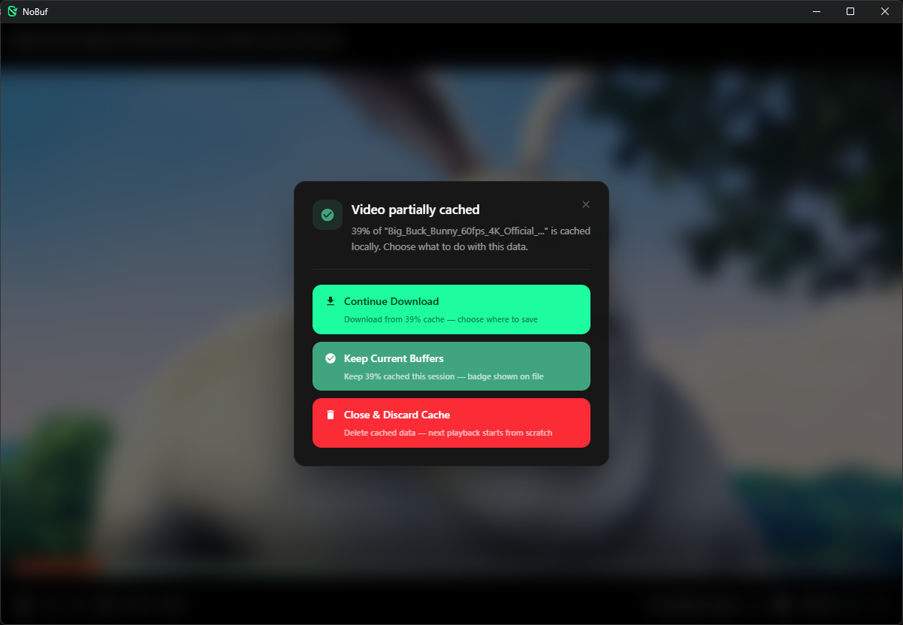
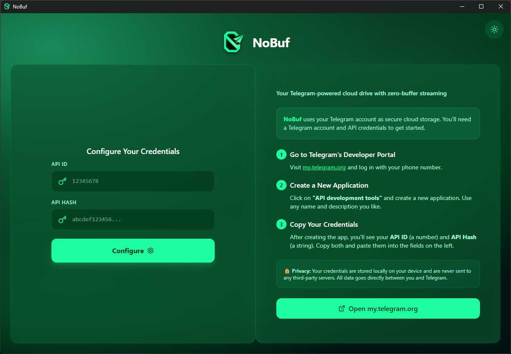

<p align="center">
  
</p>

<h1 align="center">NoBuf</h1>

<h3 align="center">Zero-buffer video streaming. Powered by Telegram.</h3>

<p align="center">
  An open-source desktop app that streams video from Telegram channels with
  continuous prebuffering — so playback never stalls, even on seeks.
</p>

<p align="center">
  <a href="https://github.com/Istiaq-Edu/NoBuf/releases"></a>
  
  
  <a href="https://github.com/Istiaq-Edu/NoBuf/actions"></a>
  
  
  
</p>

---

> ### 💡 Already have a Telegram channel?
> Just append **`[NB]`** to the channel name — NoBuf detects it automatically. No re-upload, no migration needed.
>
> *Example:* `My Media` → rename to `My Media [NB]` → it appears in NoBuf instantly.

---

## ✨ Key Highlights

> The things that make NoBuf different from every other Telegram file manager.

<table>
<tr>
<td width="50%" valign="top">

### 🎬 Zero-Buffer Streaming
First frame in **~200ms**. No download-first, no spinner. Media Source Extensions stream directly from Telegram's CDN into the browser engine with progressive fragment sizing (512KB → 8MB).

### 🔄 180s Continuous Prebuffer
While you watch, NoBuf fetches the next **180 seconds** in parallel across **3 TCP connections**. Seek anywhere — the buffer is already there. Close the player? Background cache keeps downloading.

### 📡 Public Channel Browsing
Paste any `t.me/...` link, preview, and join. Browse files with infinite scroll, forward to your folders, or stream directly — all without leaving NoBuf.

</td>
<td width="50%" valign="top">

### 🎬 Multi-Format Engine
Plays **MP4** (mp4box.js), **MPEG-TS** (mpegts.js), and **MKV/WebM** (Mediabunny transmuxer) — all with seeking and progress bar. H.264 MKV seeks natively by keyframe; HEVC MKV goes through ffmpeg remux. VP9/AV1 plays natively.

### 📲 QR Login
Scan a QR code with your Telegram app — done. No typing phone numbers or codes. Handles DC migration and flood-wait automatically.

### 🔒 Local-Only, No Telemetry
All credentials and data stay on your machine. No third-party servers, no tracking, no analytics. Optional local REST API for AI agents (off by default, SHA-256 key auth).

</td>
</tr>
</table>

---

## 🤔 Why "NoBuf"?

Because buffering is a solved problem — we just solved it differently.

NoBuf uses **Media Source Extensions** (MSE) to stream video directly from Telegram's servers into your browser engine. There's no download-first, no transcode-wait, no spinner. The player continuously prebuffers the next 180 seconds while you watch, so playback never stalls.

Telegram channels become your video library. Telegram's CDN becomes your streaming backend. **NoBuf is the player that makes it feel local.**

---

## ⚡ How It Works

```
You click play
       │
       ▼
  ┌─────────────────────────────────────────────────────────────────┐
  │  512 KB fetched from Telegram (first frame in ~200ms)           │
  │       │                                                         │
  │       ▼                                                         │
  │  Format detected (MP4 / TS / MKV / WebM)                       │
  │       │                                                         │
  │       ▼                                                         │
  │  In-browser transmuxer → MediaSource SourceBuffers              │
  │       │                                                         │
  │       ▼                                                         │
  │  ▶️  Playback starts immediately                                 │
  └─────────────────────────────────────────────────────────────────┘
       │
       │  Meanwhile, in the background:
       ▼
  ┌─────────────────────────────────────────────────────────────────┐
  │  Progressive prebuffer (next 180 seconds):                      │
  │                                                                 │
  │  512KB → 1MB → 2MB → 4MB → 8MB   (fragment sizes ramp up)      │
  │                                                                 │
  │  Downloaded bytes → disk cache (.dat + .meta)                   │
  │  Cache tracks exact byte ranges — knows what's cached            │
  │  3 parallel TCP connections saturate your bandwidth              │
  │  Overlapping range requests are deduplicated                     │
  │  VBR-accurate byte↔time calibration → correct green bar          │
  └─────────────────────────────────────────────────────────────────┘
       │
       │  You seek to a new position:
       ▼
  ┌─────────────────────────────────────────────────────────────────┐
  │  500ms debounce (prevents wasteful downloads on rapid seeks)    │
  │  Cache checked first → instant playback if already buffered      │
  │  Otherwise → fresh 512KB fetch → immediate playback              │
  │  Old buffer evicted, new prebuffer starts from seek point        │
  │  Refills stop on keyframe boundaries → zero-overlap decode       │
  └─────────────────────────────────────────────────────────────────┘
       │
       │  You close the player:
       ▼
  ┌─────────────────────────────────────────────────────────────────┐
  │  Background cache continues downloading the full video           │
  │  Gap detection finds what's missing, fills it in parallel        │
  │  Next time you open this video → instant playback from cache     │
  └─────────────────────────────────────────────────────────────────┘
```

---

## 🎬 Format Support

NoBuf's MSE engine handles multiple container formats with intelligent codec routing:

| Container | Codecs | Engine | Seek | Notes |
|-----------|--------|--------|------|-------|
| **MP4 / M4V / MOV** | H.264, H.265, VP9, AV1, AAC, MP3, AC3, Opus | mp4box.js → fMP4 | ✅ | Handles moov-at-start **and** moov-at-end |
| **MPEG-TS (.ts/.m2ts/.mts)** | H.264, H.265, AAC, MP3, AC3 | mpegts.js → fMP4 | ✅ | Backend keyframe index accelerates seeks |
| **MKV (.mkv)** | H.264 / AVC | MediabunnyTransmuxer → fMP4 | ✅ | Native keyframe seek via MKV cue index |
| **MKV (.mkv)** | H.265 / HEVC | ffmpeg `/remux` → mpegts.js | ✅ | Server-side remux to MPEG-TS |
| **MKV (.mkv)** | VP8, VP9, AV1 | Native `<video>` (WebView2) | Native | Decoded directly by the browser |
| **WebM** | VP8, VP9, Opus | Native `<video>` (WebView2) | Native | No remux needed |

> **Audio note:** Primary TS playback preserves original audio (no re-encoding). The ffmpeg `/remux` path (used for `timed_id3` TS files and HEVC MKV) re-encodes audio to AAC 192k.

> [!IMPORTANT]
> **Unsupported:** MKV with codecs not listed above falls back to native `<video>` (best-effort). Truly unsupported codecs surface a clear "unsupported codec" message in the UI.

---

## 🧠 The Tech Behind Zero-Buffer

| Feature | How | Why |
|---------|-----|-----|
| **Progressive fragments** | 512KB → 8MB sizes after seek | First frame in ~200ms, then saturate bandwidth |
| **180s prebuffer window** | Continuously fetches ahead of playback | You never outrun the buffer |
| **Disk-backed stream cache** | `.dat` data + `.meta` byte-range sidecar | Instant replay, survives app restarts |
| **Download coordinator** | Deduplicates overlapping range requests | No wasted bandwidth on concurrent seeks |
| **3× parallel TCP pool** | Split file across 3 connections to Telegram DC | ~3× bandwidth vs single-threaded |
| **Background cache** | Continues after player close | Next play is instant from cache |
| **Seek debounce** | 500ms delay for rapid seeks | Arrow-key spam doesn't spawn 15 overlapping downloads |
| **VBR byte→time calibration** | Real cue-index anchors + seek cluster bytes | Accurate green prebuffer bar for variable bitrate |
| **Keyframe-boundary refills** | MKV refills stop on exact keyframe via cue index | Zero-overlap GOP abutment → no decode crashes |
| **Source ID isolation** | Playback / thumbnail / tail reads tagged separately | Thumbnail pipeline can't cancel player downloads |
| **Dynamic cold-start overlay** | Gates playback on real buffered runway | No spinner-then-stall; plays when data is ready |
| **Pause/resume prefetch** | Paused stays paused, prebuffer persists through seeks | "Paused means paused" — only explicit resume unpauses |
| **20MB buffer cap + backpressure** | Stops downloading when ahead enough; 80MB for public channels | Prevents memory bloat on long videos |
| **Windows cache-file protection** | `.dat` files opened without `FILE_SHARE_DELETE` | Antivirus can't delete cache mid-stream |

---

## 🌟 Full Feature Set

### 📺 Streaming Engine

- 🎬 **MSE Video Player** — Media Source Extensions with format-aware routing (MP4 / TS / MKV / WebM). Progressive fragment sizing for instant first frame.
- 🔄 **Continuous Prebuffer** — 180-second look-ahead (sliding window: 180s ahead / 30s behind). Downloads while you watch.
- 💾 **Disk-Backed Cache** — Byte-range tracking with gap detection. Cached videos replay instantly.
- 🔁 **Background Cache** — Close the player, download continues. Come back later, instant playback.
- 🎞️ **Scrub Previews** — Sprite sheet generation for frame-accurate seeking.
- 🎵 **Audio Playback** — Built-in player with speed control.
- ⏸️ **Pause/Resume Prefetch** — Paused stays paused. Prebuffer persists through seeks. Only the resume button unpauses.
- 🟢 **VBR-Accurate Buffer Bar** — Green prebuffer bar calibrated from real keyframe cue anchors, not linear estimates.
- ❄️ **Cold-Start Optimization** — Dynamic threshold overlay gates playback on real buffered runway, not a timer.
- 🧩 **Source ID Isolation** — Thumbnail pipeline and player downloads are tagged separately so they can't cancel each other.

### 📁 File Management

- 📂 **Folder System** — Telegram channels as folders. Create, rename, delete, drag-and-drop.
- 🗂️ **File Explorer** — Grid and list views with virtual scrolling for thousands of files.
- 📤 **Drag & Drop Upload** — Upload queue with progress, speed tracking, and cancellation.
- 🖱️ **External Drag-Drop** — Drag files directly from Windows Explorer into NoBuf.
- 📥 **Parallel Downloads** — 3 concurrent TCP connections per file. ~3× faster than single-threaded.
- 🖼️ **Image Preview** — Inline thumbnails and full-resolution viewer.
- 📄 **PDF Viewer** — Infinite-scroll rendering with zoom and page navigation.
- 🗜️ **Archive Extraction** — Browse and extract entries from ZIP/RAR/7Z archives.
- 🔗 **Remote Upload** — Upload files from a URL directly to Telegram.

### 📡 Public Channel Browsing

- 🔍 **Paste-Link Join** — Paste any `t.me/channelname` or `t.me/+invite` link to preview and join.
- 📋 **Browse Joined** — See all your joined channels; sort by name or `[NB]` folder.
- ♾️ **Infinite Scroll** — Paginated file listing with `IntersectionObserver`.
- 📤 **Forward to Folder** — Forward files from public channels to your private folders.
- 🔒 **Read-Only Mode** — Not-a-member channels show a banner and prevent download/stream.
- 🏷️ **`[NB-PUB]` Auto-Sync** — Public channels with `[NB-PUB]` in the name are auto-synced.

### 🔐 Authentication

- 📱 **Phone + Code + 2FA** — Standard Telegram login flow with two-factor support.
- 📲 **QR Login** — Scan a QR code with your Telegram app to log in instantly. Handles DC migration and flood-wait protection.
- 🔄 **Auto-Reconnect** — Detects dropped connections and re-establishes them automatically.
- 🛡️ **Session Recovery** — Corrupted session files are detected and recreated automatically.

### ⚙️ Platform

- 🤖 **REST API** — Local HTTP API (off by default) with API key auth. Enables AI agents and automation.
- 📊 **Bandwidth Monitor** — Daily upload/download tracking with configurable limits.
- 🎚️ **Speed Limiter** — Per-session throttle for streaming and downloads.
- 🔄 **Auto-Updates** — Built-in update delivery via Tauri's updater plugin.
  > [!CAUTION]
  > **Auto-update is not yet active.** Watch [Releases](https://github.com/Istiaq-Edu/NoBuf/releases) for new builds.
- 🔒 **Local-Only** — All credentials and data stay on your machine. No telemetry, no third-party servers.
- 🖥️ **Cross-Platform** — Windows, macOS (Intel + Apple Silicon), Linux (AppImage + .deb).
- 🚪 **Exit Options** — Choose what happens on close: minimize to tray, quit, or cancel.
- 🎛️ **Video Player Settings** — Playback speed, video fit mode, brightness, rotation, and loop control.

---

## 🏗️ Architecture

```
┌─────────────────────────────────────────────────────────────────┐
│                        Tauri v2 Desktop Shell                    │
│                                                                  │
│  ┌───────────────────────────────────────────────────────────┐  │
│  │  React 19 + TypeScript + TailwindCSS 4                     │  │
│  │                                                            │  │
│  │  ┌──────────────┐  ┌──────────────┐  ┌────────────────┐  │  │
│  │  │ FastStream    │  │ File Explorer │  │ Public Channel  │  │
│  │  │ MSE Engine    │  │ (Grid/List)   │  │ Browser         │  │
│  │  │               │  │               │  │                 │  │
│  │  │ mp4box.js     │  │ Drag & Drop   │  │ Paste-Link Join │  │
│  │  │ mpegts.js     │  │ Virtual Scroll│  │ Infinite Scroll │  │
│  │  │ Mediabunny    │  │ Thumbnails    │  │ Forward/Remove  │  │
│  │  │ SourceBuffer  │  │ PDF Viewer    │  │                 │  │
│  │  │ Prebuffer      │  │               │  │                 │  │
│  │  └──────┬────────┘  └───────┬───────┘  └────────┬────────┘  │  │
│  └─────────┼──────────────────┼────────────────────┼──────────┘  │
│            │       Tauri IPC Commands (74 commands) │             │
│  ┌─────────┴──────────────────┴────────────────────┴──────────┐  │
│  │                    Rust Backend (Grammers)                    │  │
│  │                                                              │  │
│  │  ┌──────────────┐ ┌───────────────┐ ┌────────────────────┐  │  │
│  │  │ Auth         │ │ File System   │ │ Download Pool       │  │  │
│  │  │ (phone/QR/   │ │ (CRUD/Move/   │ │ (3 parallel TCP     │  │
│  │  │  2FA)        │ │  Upload)      │ │  connections)       │  │
│  │  └──────────────┘ └───────────────┘ └────────────────────┘  │  │
│  │  ┌──────────────┐ ┌───────────────┐ ┌────────────────────┐  │  │
│  │  │ Stream Cache │ │ Coordinator   │ │ Public Channels    │  │  │
│  │  │ (.dat + .meta│ │ (dedup range  │ │ (join/list/sync/   │  │  │
│  │  │  byte ranges)│ │  requests)    │ │  forward/remove)   │  │  │
│  │  └──────────────┘ └───────────────┘ └────────────────────┘  │  │
│  └──────────────────────────────────────────────────────────────┘  │
│                                                                  │
│  ┌─────────────────────────┐  ┌────────────────────────────────┐ │
│  │  Streaming Server        │  │  REST API Server                │ │
│  │  Actix-web :14201        │  │  Actix-web :configurable        │ │
│  │                          │  │                                  │ │
│  │  GET /stream/{id}/{msg}  │  │  GET /api/v1/files              │ │
│  │  GET /remux/{id}/{msg}   │  │  GET /api/v1/files/{id}         │ │
│  │  GET /fmp4/*             │  │  GET /api/v1/files/{id}/download│ │
│  │  Range requests          │  │  X-API-Key auth                 │ │
│  │  Cache-first serving     │  │  SHA-256 key hashing            │ │
│  └────────────┬─────────────┘  └────────────────────────────────┘ │
└───────────────┼──────────────────────────────────────────────────┘
                │
                ▼
       ┌──────────────────┐
       │  Telegram Cloud  │
       │  (MTProto API)   │
       │                  │
       │  Channels        │──→ Video Library
       │  Saved Messages  │──→ Quick Access
       │  Public Channels │──→ Browse & Stream
       └──────────────────┘
```

---

## 🛠️ Tech Stack

| Layer | Technology |
|-------|-----------|
| **Frontend** | React 19, TypeScript, TailwindCSS 4, Framer Motion |
| **Video Engine** | mp4box.js (MP4 demux), mpegts.js (TS demux), Mediabunny (MKV/WebM transmux), MediaSource Extensions |
| **Backend** | Rust, Grammers (Telegram MTProto), Actix-web 4 |
| **Streaming** | Byte-range HTTP, disk cache, download coordinator, ffmpeg-sidecar remux |
| **Media** | ffmpeg-sidecar, pdfjs-dist |
| **Build** | Tauri v2, Vite 7, Cargo |
| **Testing** | Vitest, Testing Library |
| **CI/CD** | GitHub Actions (Win / Linux / macOS-Intel / macOS-ARM) |

---

## 📸 Screenshots

| Main Dashboard | Grid View |
|:--------------:|:---------:|
|  |  |

| List View | Video Player Settings |
|:---------:|:---------------------:|
|  |  |

| Preview Thumbnails | Cache Playback |
|:------------------:|:--------------:|
|  |  |

| Settings | Exit Options |
|:--------:|:------------:|
|  |  |

| Download / Upload | Authentication |
|:-----------------:|:--------------:|
|  |  |

---

## 🚀 Quick Start

### Prerequisites

- **Node.js v18+** — [nodejs.org](https://nodejs.org)
- **Rust (latest stable)** — install via [rustup.rs](https://rustup.rs)
- **Telegram API credentials** — obtain from [my.telegram.org](https://my.telegram.org) → API development tools

<details>
<summary><strong>🖥️ Windows</strong></summary>

- Install [Visual Studio Build Tools](https://visualstudio.microsoft.com/visual-cpp-build-tools/) — select **"Desktop development with C++"**
- Windows 10/11 includes WebView2. If not, download from [Microsoft](https://developer.microsoft.com/en-us/microsoft-edge/webview2/#download-section).

</details>

<details>
<summary><strong>🍎 macOS</strong></summary>

```bash
xcode-select --install
```

</details>

<details>
<summary><strong>🐧 Linux (Ubuntu/Debian)</strong></summary>

```bash
sudo apt update && sudo apt install libwebkit2gtk-4.1-dev build-essential curl wget file \
  libxdo-dev libssl-dev libayatana-appindicator3-dev librsvg2-dev
```

</details>

### Install & Run

```bash
# 1. Clone
git clone https://github.com/Istiaq-Edu/NoBuf.git
cd NoBuf

# 2. Install frontend dependencies
cd app
npm install

# 3. Run in development mode
npm run tauri dev

# 4. Build for production
npm run tauri build
```

> **First build takes 5–15 minutes** — Rust compiles 670+ crates on initial build. Subsequent builds are fast.

---

## 📡 REST API

NoBuf includes a local REST API for programmatic access and AI integration. **Disabled by default** — enable in Settings.

### Endpoints

| Method | Path | Description |
|--------|------|-------------|
| `GET` | `/api/v1/health` | Health check + version |
| `GET` | `/api/v1/files` | List files (paginated, filterable by folder/search) |
| `GET` | `/api/v1/files/{message_id}` | Get file metadata |
| `GET` | `/api/v1/files/{message_id}/download` | Download file (supports Range headers) |
| `HEAD` | `/api/v1/files/{message_id}/download` | File metadata + content-length discovery |

### Authentication

All endpoints require the `X-API-Key` header. Generate a key in Settings → API. Keys are **SHA-256 hashed locally** — the raw key is only shown once.

```bash
curl -H "X-API-Key: YOUR_KEY" http://localhost:PORT/api/v1/files?limit=10
```

---

## 📊 Project Stats

| Metric | Value |
|--------|-------|
| **Total commits** | 336+ |
| **Tauri commands** | 74 |
| **Rust source files** | 25 |
| **TypeScript/TSX files** | 100+ |
| **Unit tests** | 133 passing |
| **Supported formats** | MP4, TS, MKV, WebM (+ codecs) |
| **License** | MIT |

---

## 🙏 Acknowledgments

- **[Telegram-Drive](https://github.com/caamer20/Telegram-Drive)** — NoBuf's core architecture is based on caamer20's Telegram-Drive project. The idea of using Telegram channels as a file storage backend and the initial Tauri + Grammers integration originate from this work.
- **[FastStream](https://github.com/Andrews54757/FastStream)** — the MSE video prebuffering engine and progressive fragment strategy were adapted from Andrews54757's FastStream project. The `lib/faststream/` module is based on their approach to Media Source Extensions streaming.
- **[Mediabunny](https://github.com/nicholaschiasson/mediabunny)** — the in-browser MKV/WebM transmuxing engine that powers native keyframe seeking for Matroska containers.

---

<p align="center">
  <sub>This application is not affiliated with Telegram FZ-LLC. Use responsibly and in accordance with Telegram's Terms of Service.</sub>
</p>
